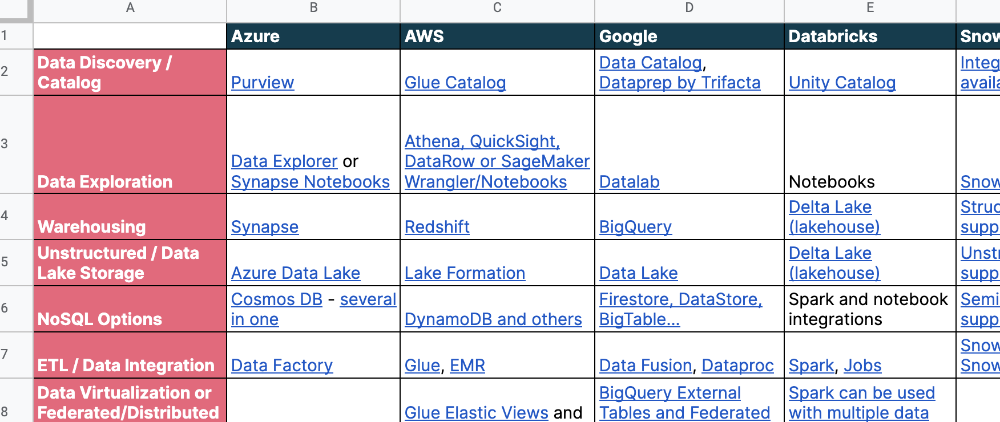

# Data Platforms and Tools

The [landscape of data tools](https://mattturck.com/data2021/) is large and fast-changing. This project serves these primary purposes:

- To show what data platforms are out there and their key capabilities
- To show what tools are out there for certain specific capabilities

An aim behind this is to make it easier to find tools that can fulfill specific roles in a [Data Mesh architecture](https://martinfowler.com/articles/data-mesh-principles.html). But the focus is on the capabilities and so is not exclusive to Data Mesh.

## Data Platforms and Tools Spreadsheet

This [public spreadsheet](https://docs.google.com/spreadsheets/d/1oKeGDNggsOVtqGK_ZL4NgR2fxVntC25xDbcPlk3QOco/edit?usp=sharing) contains tabs on Data Platforms and Data Tools:

The Data Platforms tab lists the key features for prominent Data Platforms. It links to documentation on features rather than going into detail itself. This offer a starting-point to readers to deep-dive further.

The Tools Breakdown tab presents categories for tools and links out to online guides that provide more details and explanation on each category. The categories are structured around the principles of a [Data Mesh architecture](https://martinfowler.com/articles/data-mesh-principles.html).

## Data Mesh and the Tool Landscape

Selecting technology for a Data Mesh implementation can be challenging. In addition to the material here, more general guidance will be provided - COMING SOON.

### Contributions

Changes are welcome by PR or issues - please create a copy of the spreadsheet, link to or upload your copy and explain which parts are changed. Please follow the existing format or raise an issue in advance to suggest changes to the format. On approval the [master spreadsheet](https://docs.google.com/spreadsheets/d/1nRqjnD7SCMJGmYR2gdZJ84YolLnHAMJwjSG7z7VcM6c/edit?usp=sharing) will be updated.

If you spot anything inaccurate or out of date then please raise an issue.
